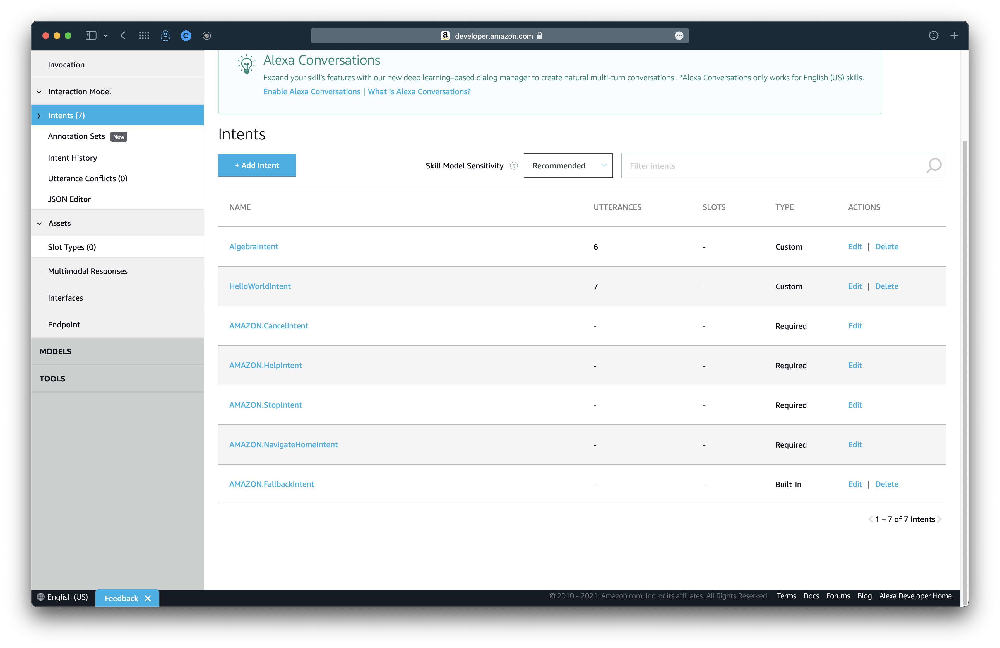
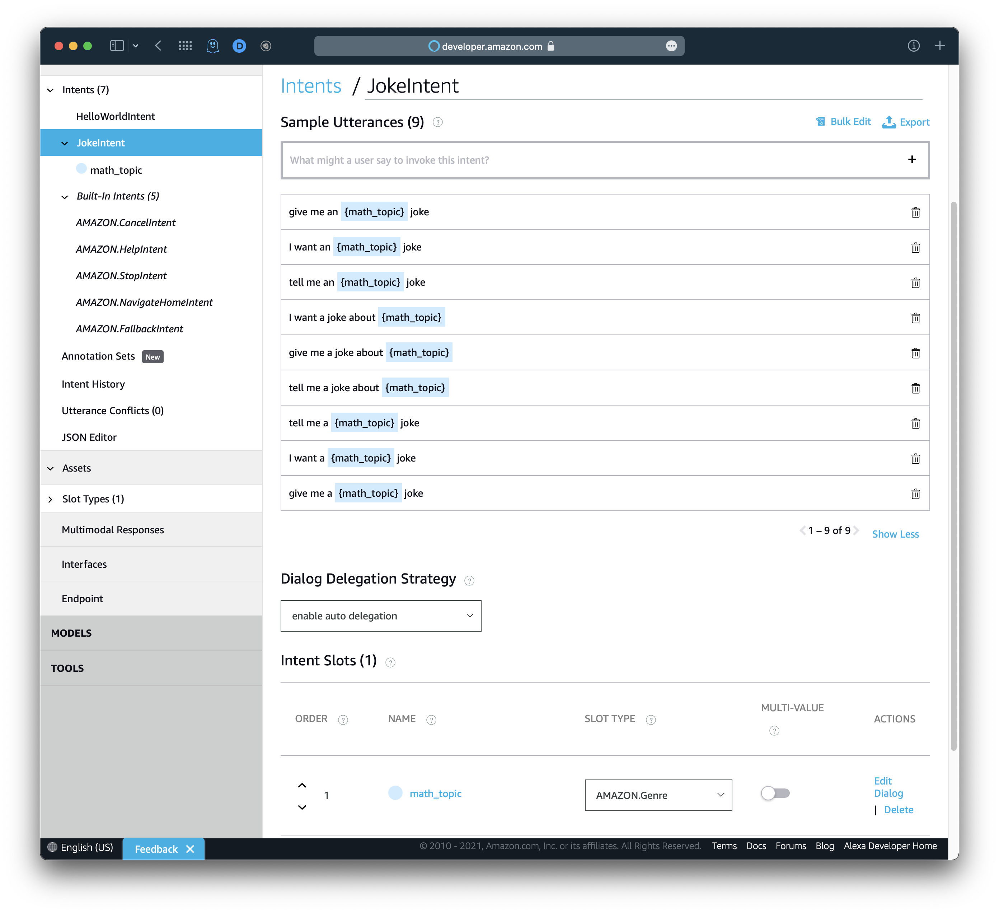
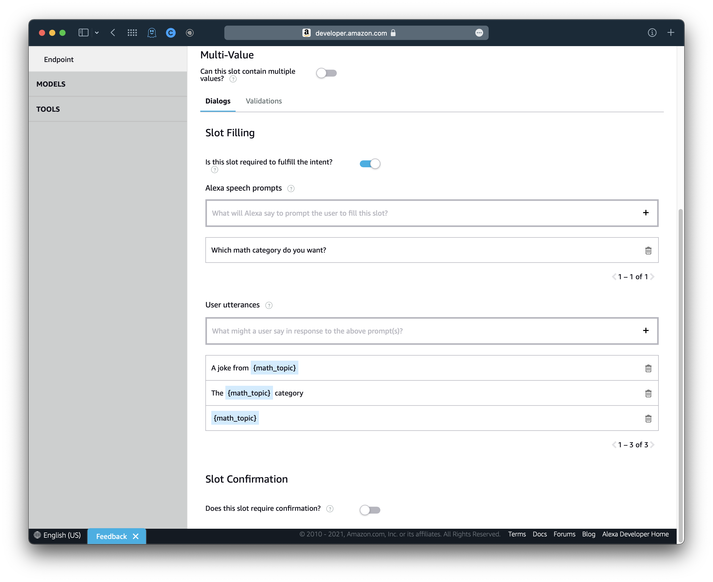
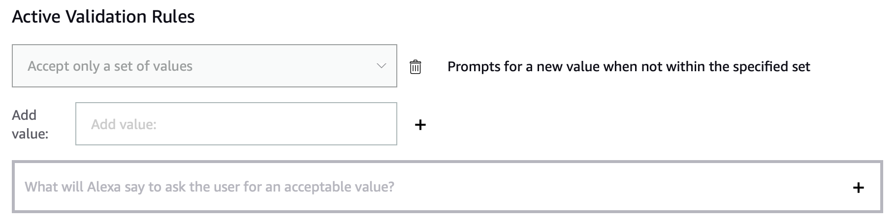
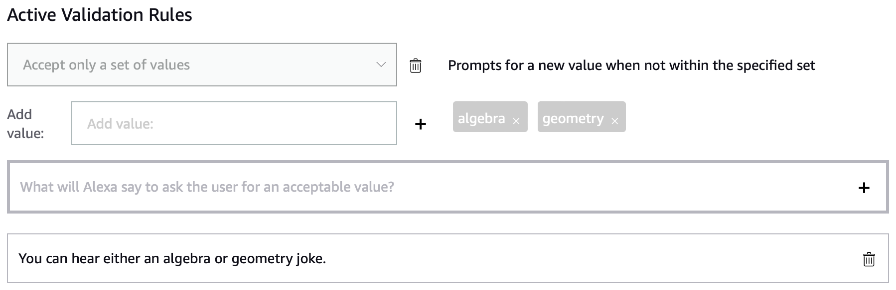
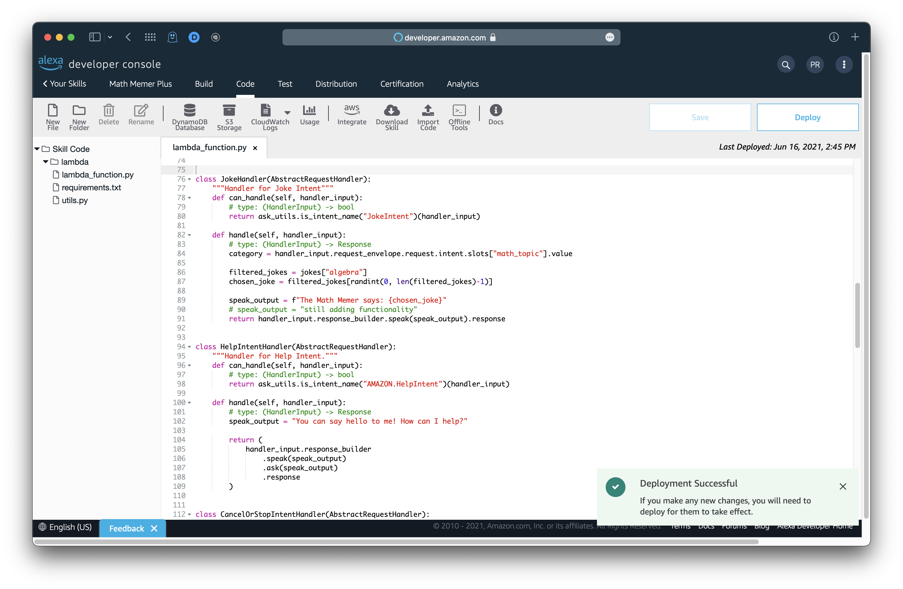
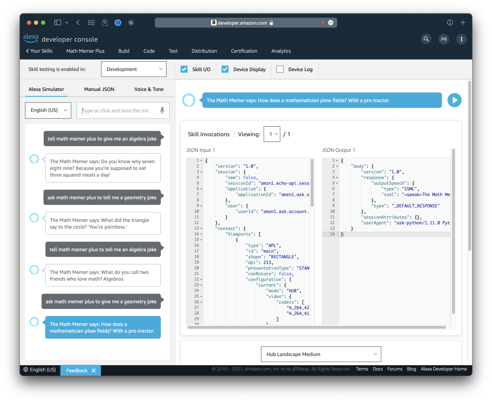

# Math Memer Plus - Slot Example

*Pranav Ramesh*

## Introduction

In a previous exercise, we designed **Math Memer Plus**, a skill where Alexa would produce a math meme from a topic of the user's choosing. Previously we used separate intents to get Alexa to read jokes from different math categories. Usually, in a skill, we use different intents to accomplish different goals. However, in our previous case, the different intents were achieving the same purpose: to read a math joke. The only thing that was different was the joke type. As such, we can instead use **slots** in our utterances, so that we can simply reuse an intent rather than create additional ones.

## Remove extra intents

We will begin by removing some extra intents. Open the "Math Memer Plus" example, go to the **Build** tab, and select **Intents** in the sidebar. In the previous example, we had created two intents: `AlgebraIntent` and `GeometryIntent`. If you chose to, you may have had extra intents for extra topics. For now, delete `GeometryIntent` and any extra intent that you added for additional topics; leave `AlgebraIntent` as is.



## Adding slot to existing intent

We will now modify `AlgebraIntent`. Click `AlgebraIntent`. Then, change the intent title to `JokeIntent`. Next, under **Intent Slots**, type `math_topic` into the text field labeled *Create a new slot*. Click the `+` button or hit enter, and in the slot type dropdown, select `AMAZON.Genre`.

After that, under **Sample Utterances**, replace every instance of "algebra" with `{math_topic}`. We do this so that Alexa will know to associate our input with that slot variable. There may be some utterances that aren't currently visible, so make sure you go through all pages of sample utterances.

Note that our math topic can either begin with a vowel or a consonant. In English, it makes sense to put "an" before a vowel-prefixed word, and "a" before a consonant-prefixed word. Alexa may not automatically account for this difference in indefinite articles, so we must account for it ourselves. For the following sample utterances, duplicate them so that the duplicates include "an" instead of "a".

*   *"tell me <u>a</u> `{math_topic}` joke" --> "tell me <u>an</u> `{math_topic}` joke"*
*   *"I want <u>a</u> `{math_topic}` joke" --> "I want <u>an</u> `{math_topic}` joke"*
*   *"give me <u>a</u> `{math_topic}` joke" --> "give me <u>an</u> `{math_topic}` joke"*

Finally, under **Dialog Delegation Strategy**, select *enable auto delegation* from the drop down menu.



Now that we've defined a slot, `math_topic`, and referenced it in our sample utterances, we need to provide some constraints for the slot values. This is what we would call **validation** - we make sure the user passes a value to Alexa that Alexa can correctly interpret given the code we've written. Since our skill only gives algebra and geometry jokes (as well as any additional that you added), we must constraint the accepted values of the `math_topic` slot to those inputs. In addition to validation, we need to make our slot *required*; the user could potentially invoke the skill with this intent without giving a value for the slot, which would break our program.

To start, click **Edit Dialog** under actions. Check off the box for the question *"Is this slot required to fulfill the intent?"*. Under **Alexa speech prompts**, write *"Which math category do you want?"*. Then, add the following user utterances as responses to the previous prompt:

-   "A joke from `{math_topic}`"
-   "The `{math_topic}` category"
-   "`{math_topic}`"



Next, we will constraint our input to accept only algebra, geometry, and any additional topics that you added. Select the **Validations** tab, click the drop down menu under **Create Validation Rule**, and select *Accept only a set of values*. Then, click `+`.

You will see a new portion of the window pop up:



In the *Add value* text field, write algebra and geometry, separately. Then, in the prompt below, enter *"You can hear either an algebra or geometry joke."* (This prompt can be modified if you have additional topics.)



Finally, click **Save Model** and **Build Model**.

## Modifying the code

We will now update the code to reflect the changes in the built model. Go to the **Code tab**. We currently have the following code. Wherever there is a `# DELETE` comment, delete the line:

```python
# ...
# ...
# ...

from random import randint

jokes = {
    "algebra": [
        "What do you call two friends who love math? Algebros.",
        "Do you know why seven eight nine? Because you’re supposed to eat three squared meals a day!",
        "Why do plants hate math? Because it gives them square roots.",
        "Why do atheists have trouble with exponents? They don’t believe in higher powers!"
    ],
    "geometry": [
        "What did the triangle say to the circle? 'You’re pointless.'",
        "I saw my math teacher with a piece of graph paper yesterday. I think he must be plotting something.",
        "How does a mathematician plow fields? With a pro-tractor.",
        "What’s a math teacher’s favorite kind of tree? Geometry.",
        "Parallel lines have so much in common... It’s a shame they’ll never meet."
    ]
}

# ...
# ...
# ...

class AlgebraJokeHandler(AbstractRequestHandler):
    """Handler for Algebra Intent"""
    def can_handle(self, handler_input):
        # type: (HandlerInput) -> bool
        return ask_utils.is_intent_name("AlgebraIntent")(handler_input)
    
    def handle(self, handler_input):
        # type: (HandlerInput) -> Response
        filtered_jokes = jokes["algebra"]
        chosen_joke = filtered_jokes[randint(0, len(filtered_jokes)-1)]
        
        speak_output = f"The Math Memer says: {chosen_joke}"
        return handler_input.response_builder.speak(speak_output).response

# DELETE THE FOLLOWING:
'''
class GeometryJokeHandler(AbstractRequestHandler):
    """Handler for Geometry Intent"""
    def can_handle(self, handler_input):
        # type: (HandlerInput) -> bool
        return ask_utils.is_intent_name("GeometryIntent")(handler_input)
        
    def handle(self, handler_input):
        # type: (HandlerInput) -> Response
        filtered_jokes = jokes["geometry"]
        chosen_joke = filtered_jokes[randint(0, len(filtered_jokes)-1)]
        
        speak_output = f"The Math Memer says: {chosen_joke}"
        return handler_input.response_builder.speak(speak_output).response
'''
# ...
# ...
# ...

sb = SkillBuilder()

sb.add_request_handler(LaunchRequestHandler())
sb.add_request_handler(HelloWorldIntentHandler())
sb.add_request_handler(HelpIntentHandler())
sb.add_request_handler(CancelOrStopIntentHandler())
sb.add_request_handler(FallbackIntentHandler())
sb.add_request_handler(SessionEndedRequestHandler())
sb.add_request_handler(AlgebraJokeHandler())
sb.add_request_handler(GeometryJokeHandler())	# DELETE
sb.add_request_handler(IntentReflectorHandler()) # make sure IntentReflectorHandler is last so it doesn't override your custom intent handlers

sb.add_exception_handler(CatchAllExceptionHandler())

lambda_handler = sb.lambda_handler()
```

We are removing the `GeometryJokeHandler()` class because we are going to use the `AlgebraJokeHandler` class, which we will rename, to get our joke from the desired category.

Rename the `AlgebraJokeHandler` class to `JokeHandler`. Where you write `sb.add_request_handler(AlgebraJokeHandler())`, replace `AlgebraJokeHandler` with `JokeHandler`. Additionally, in `can_handle()`, replace `AlgebraIntent` with `JokeIntent`.

```python
# ...

class JokeHandler(AbstractRequestHandler):
    """Handler for Joke Intent"""
    def can_handle(self, handler_input):
        # type: (HandlerInput) -> bool
        return ask_utils.is_intent_name("JokeIntent")(handler_input)
    
    def handle(self, handler_input):
        # type: (HandlerInput) -> Response
        filtered_jokes = jokes["algebra"]
        chosen_joke = filtered_jokes[randint(0, len(filtered_jokes)-1)]
        
        speak_output = f"The Math Memer says: {chosen_joke}"
        return handler_input.response_builder.speak(speak_output).response
    
# ...
sb.add_request_handler(JokeHandler())
# ...
```

Now, we must change `filtered_jokes = jokes["algebra"]`. This `"algebra"` string will instead be a slot value. Above the `filtered_jokes` variable assignment, write the following:

```python
def handle(self, handler_input):
    # type: (HandlerInput) -> Response
    category = handler_input.request_envelope.request.intent.slots["math_topic"].value
    
    filtered_jokes = jokes["algebra"]
    chosen_joke = filtered_jokes[randint(0, len(filtered_jokes)-1)]

    speak_output = f"The Math Memer says: {chosen_joke}"
    return handler_input.response_builder.speak(speak_output).response
```

Let's break this line down.

*   `handler_input` is the entire input Alexa retrieved.
*   `.request_envelope.request.intent` gets the intent called. In this case, the intent would be `JokeIntent`.
*   `.slots["math_topic"].value` is the math topic Alexa retrieved from the user. `.slots` is the dictionary, and the value associated with the `"math_topic"` key is an object whose value attribute is the math topic the user gave.

Finally, update `filtered_jokes = jokes["algebra"]` so that `"algebra"` is replaced with `category`.

```python
def handle(self, handler_input):
    # type: (HandlerInput) -> Response
    category = handler_input.request_envelope.request.intent.slots["math_topic"].value
    
    filtered_jokes = jokes[category]
    chosen_joke = filtered_jokes[randint(0, len(filtered_jokes)-1)]

    speak_output = f"The Math Memer says: {chosen_joke}"
    return handler_input.response_builder.speak(speak_output).response
```

**Save** and **deploy** your code.



## Testing the skill

Before we proceed to test our skill, ensure that you have **built** your model and **deployed** your code. After that, click the **Test** tab on the top of the page. In the dropdown next to "Skill testing is enabled in", select **Development**. This will allow us to converse with Alexa.

To ask Alexa to recite jokes on each topic, you can say:

<center><i>Ask math memer plus to {your intent in an utterance}</i></center>

Some examples include the following:

*   "ask math memer plus to tell me an algebra joke"
*   "ask math memer plus to tell me a geometry joke"

Refer to your sample utterances for a more comprehensive list of what you can ask. If Alexa tells you that it had trouble with the request, type/say "quit" and repeat the utterance again.



**Congratulations! You've created a successful skill with an intent that uses a slot to produce a topic-specific math joke when invoked!**

```python
def isEven(x):
    return x % 2 == 0
```

You should use the `print()` statement